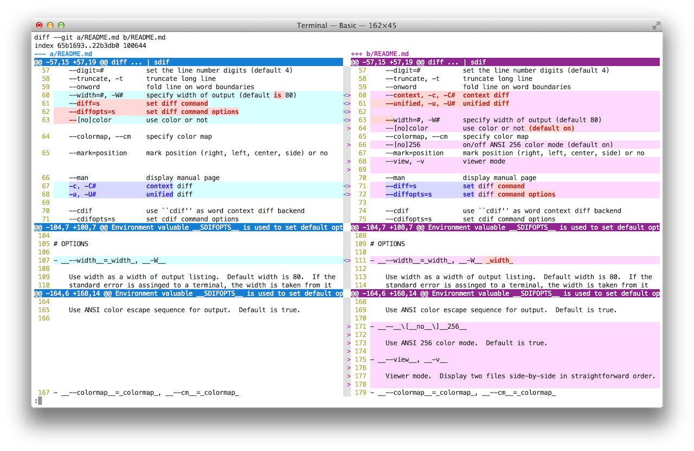
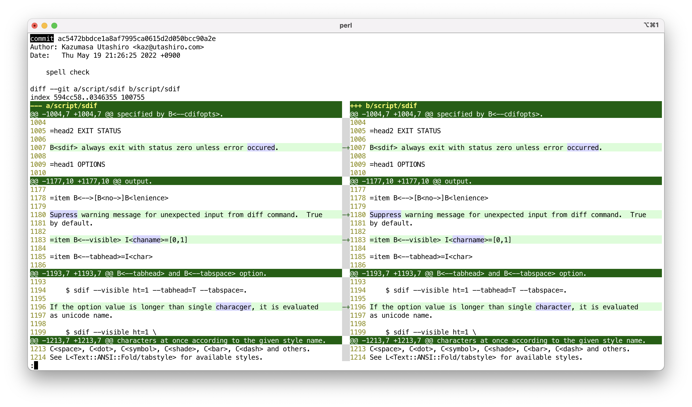
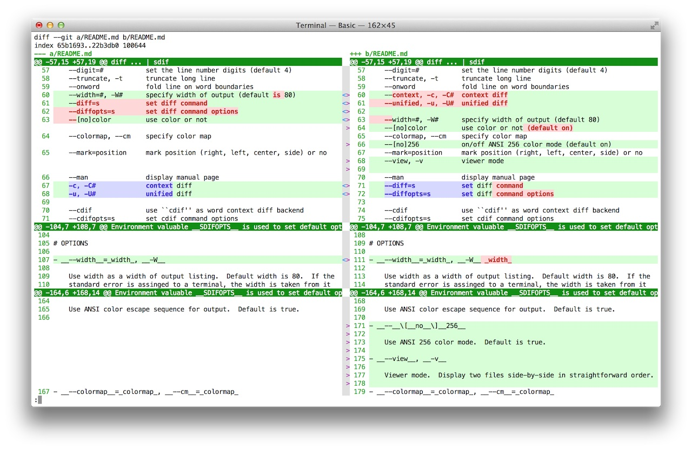
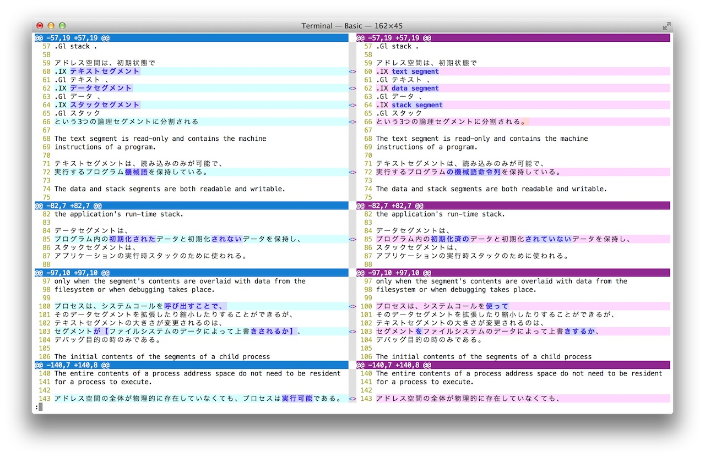
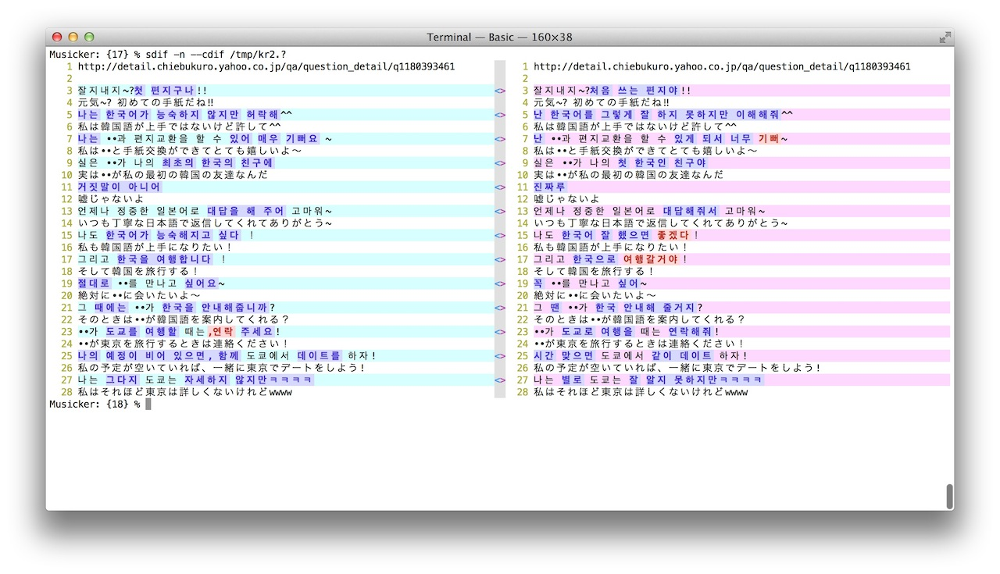
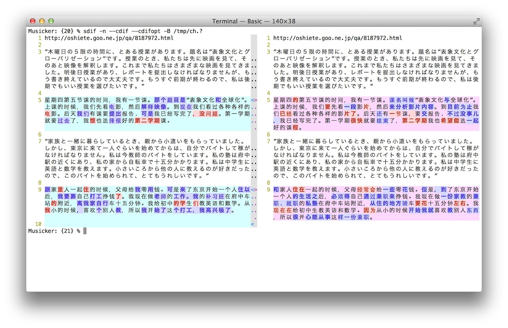
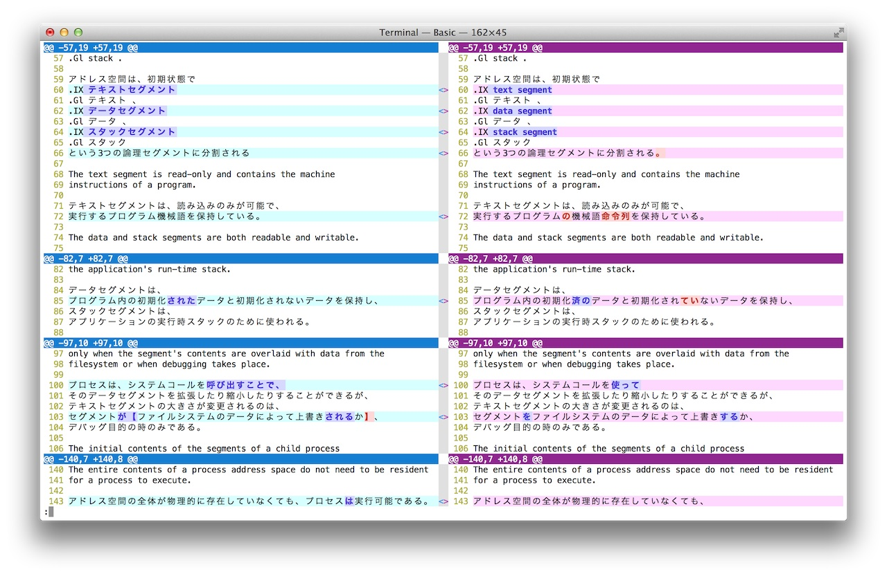
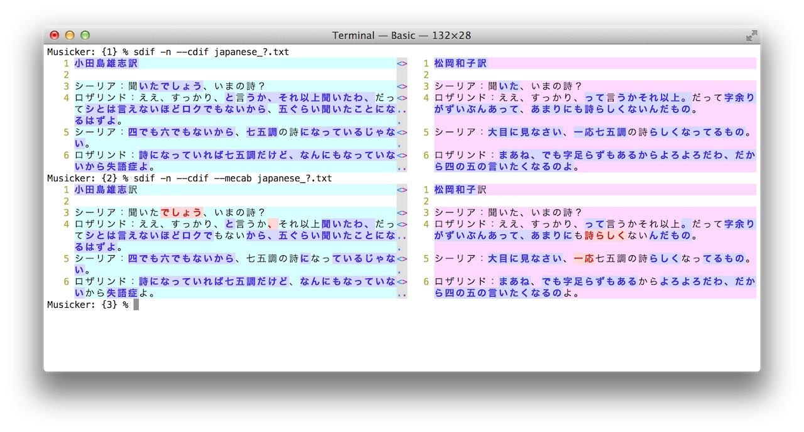
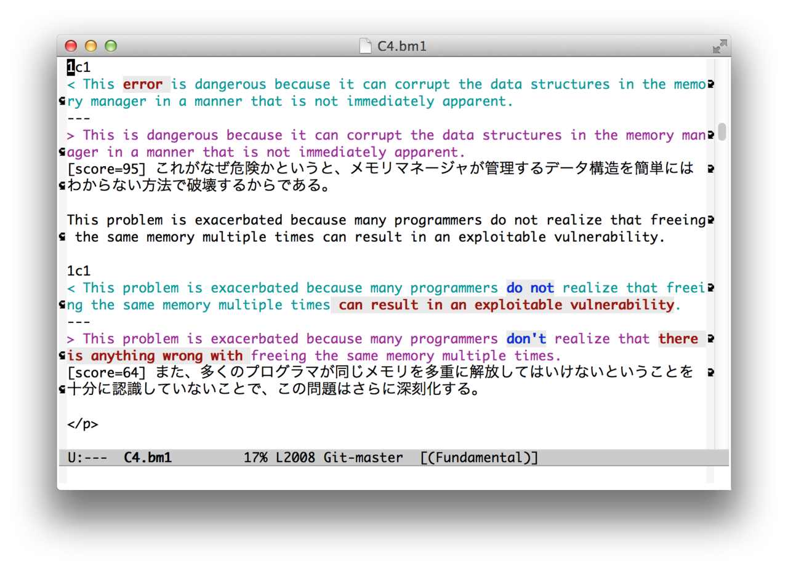

## Git

## Flexible color

### ANSI 256 colors

## International Language Support

### Japanese Kanji/Hiragana/Katakana separation

### Korean

### Chinese

## Japanese syllable tokenizer

### --mecab morphology

## Tool Support

### Emacs

